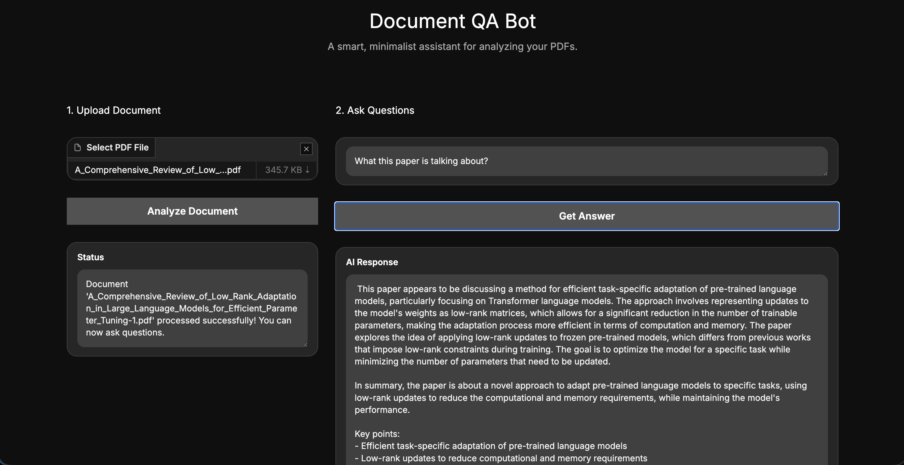

# GenAI RAG QA Bot

This project is a multimodal Retrieval-Augmented Generation (RAG) application built using LangChain, Gradio, and ChromaDB. It functions as a document QA bot that allows users to upload documents (PDF, DOCX, TXT), images (PNG, JPG), and media (MP4, MP3) and ask questions about their content using a custom IBM WatsonX Large Language Model integration.



## Prerequisites

Before setting up the project, ensure you have the following installed on your machine:
* Python 3.9+
* Git
* `ffmpeg` (Required for Whisper audio/video transcription)
* `tesseract` (Required for OCR image scanning)

## Step-by-Step Setup Guide

### Step 1: Clone the Repository
Open your terminal and clone the repository to your local machine.
```bash
git clone https://github.com/WilWilbert123/GenAI-RAG-LangChain.git
cd GenAI-RAG-LangChain
```

### Step 2: Set up a Virtual Environment
It is highly recommended to isolate the project dependencies using a virtual environment.
```bash
python -m venv venv
source venv/bin/activate
```

### Step 3: Install Required Dependencies
Install all the necessary Python packages using the provided requirements file.
```bash
pip install -r requirements.txt
```

### Step 4: Configure Environment Variables
Create a file named `.env` in the root directory of the project. This file is required to authenticate with the IBM WatsonX API. Add the following lines to the file, replacing the placeholder values with your actual credentials:
```env
WATSONX_API_KEY=your_api_key_here
WATSONX_PROJECT_ID=your_project_id_here
WATSONX_URL=your_url_here
```

### Step 5: Start the Application
Run the main application script to start the Gradio web server.
```bash
python app.py
```

### Step 6: Access the Web Interface
Once the server starts, it will display a local URL in the terminal (typically http://127.0.0.1:7860 or similar). Open this link in your web browser.

## Usage Guide

1. **Upload Document**: Drag and drop a file into the upload area. It supports Documents (PDF, DOCX, CSV), Images (PNG, JPG), and Media (MP4, MP3).
2. **Auto-Analyze**: The system will automatically detect the file type, extract the text/audio/images using OCR and Whisper, chunk it, and store the embeddings in a local Chroma vector database.
3. **Wait for Status**: Look at the Status box to confirm that the document was processed successfully.
4. **Ask Questions**: Type your query in the "Your Question" box, or click on one of the Examples.
5. **Get Answer**: The system will instantly retrieve the most relevant chunks of text from your document and use the IBM WatsonX LLM to generate an accurate summary or answer in real-time.

## Deploying on Hugging Face Spaces (Recommended)

Hugging Face Spaces is specifically designed for hosting heavy AI applications (like this Gradio app) and handles massive machine learning libraries like `torch` perfectly for free.

1. **Create an Account:** Go to [Hugging Face](https://huggingface.co/) and create a free account.
2. **Create a New Space:** Click on your profile icon -> **New Space**.
3. **Configure Space:** 
   * Name your space.
   * Select **Gradio** as the Space SDK.
   * Choose **Public** or **Private**.
4. **Link GitHub:** In your newly created Space, follow the instructions to either clone it locally and push your code, or connect your GitHub repository directly. (Hugging Face will automatically read the `packages.txt` and `requirements.txt` to build the app).
5. **Set Environment Variables:** Go to your Space's **Settings** tab -> **Variables and secrets** and add your WatsonX keys as **Secrets**:
   * `WATSONX_API_KEY`
   * `WATSONX_PROJECT_ID`
   * `WATSONX_URL`
6. **Watch it Build:** Once pushed and configured, Hugging Face will build and launch your application!

## Deploying on Vercel (Not Recommended)

If you still want to try to deploy this application to Vercel, the necessary configurations (`vercel.json` and `api/index.py`) have already been included in this repository. 

> 🛑 **Warning:** Vercel's Free Tier has strict size limits (250MB) and timeouts (10 seconds) for Serverless Functions. Heavy libraries like `torch` and processing times for tools like `whisper` will cause deployment failures or timeouts. Vercel is **not recommended** for this app.

### Step-by-Step Vercel Guide:
1. **Push your code to GitHub:** Ensure your latest code is pushed to your GitHub repository.
2. **Import to Vercel:** Go to your Vercel Dashboard, click **Add New** -> **Project**, and import your GitHub repository.
3. **Configure Environment Variables:** In the Vercel setup screen, open the "Environment Variables" section and add your IBM WatsonX credentials:
   * `WATSONX_API_KEY`
   * `WATSONX_PROJECT_ID`
   * `WATSONX_URL`
4. **Build Settings:** Vercel will automatically detect the Python environment. Leave the Build Command and Install Command as their defaults (Vercel will run `pip install -r requirements.txt` automatically).
5. **Deploy:** Click **Deploy**. Vercel will build your environment and route traffic to the Gradio app through FastAPI via the `api/index.py` file!

## Architecture and Tools

* **LangChain**: Orchestrates the RAG pipeline.
* **PyPDFLoader**: Extracts text from the uploaded PDF documents.
* **RecursiveCharacterTextSplitter**: Splits the document into optimized chunks for embedding.
* **Chroma**: Local vector database for storing and querying text embeddings.
* **HuggingFaceEmbeddings**: Generates the vector representations of the text.
* **IBM WatsonX REST API**: Custom integration for LLM inference (using Llama 3 70B).
* **Gradio**: Provides the minimalist, dark-mode web user interface.
